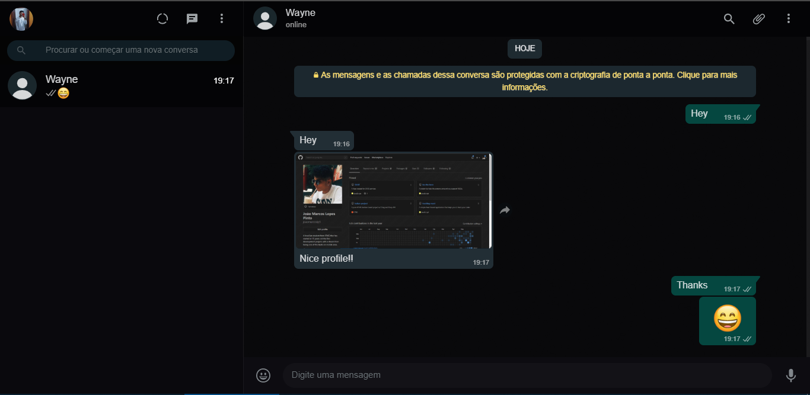

<h1 align="center">WhatsApp Web Dark</h1>

  

<h2 align="center">Your eyes will ❤️ you.</h2>

## Installation

  Install <a href="https://add0n.com/stylus.html" rel="nofollow">Stylus</a> for either <a href="https://addons.mozilla.org/en-US/firefox/addon/styl-us/" rel="nofollow">Firefox</a>, <a href="https://chrome.google.com/webstore/detail/stylus/clngdbkpkpeebahjckkjfobafhncgmne" rel="nofollow">Chrome (or Chromium based browsers)</a> or <a href="https://addons.opera.com/en-gb/extensions/details/stylus/" rel="nofollow">Opera</a> or <a href="https://cascadea.app/" rel="nofollow">Cascadea for Safari</a> and then install by pressing the button below

